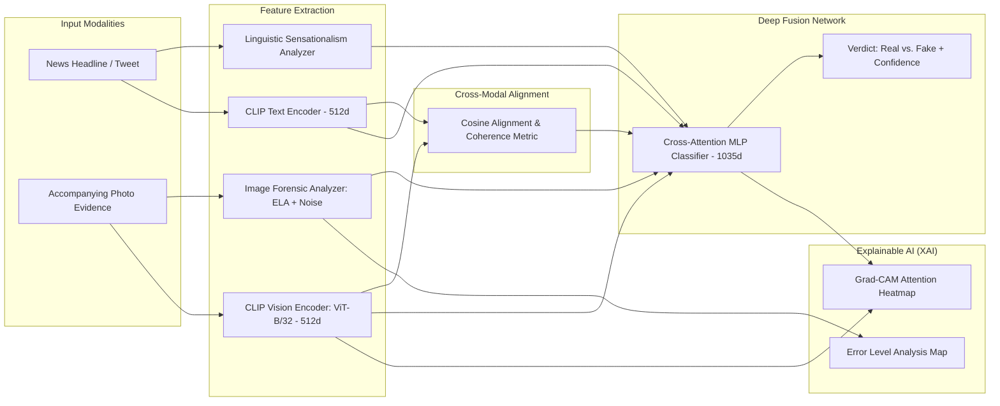

# Veritas AI: Multimodal Fake Content Detection System

An end-to-end AI platform for detecting multimodal misinformation, deceptive cheapfakes (out-of-context news), and AI-synthesized content using **OpenCLIP (ViT-B/32)**, **Digital Image Forensics (Error Level Analysis)**, and **Deep Neural Fusion**.

---

## 1. Project Overview & Motivation

Traditional fake news detection relies on either text analysis (NLP sentiment/clickbait) or image forgery detection (Photoshop/deepfake artifacts). However, over **70% of modern social media misinformation is Multimodal Cheapfakes**:
- **Genuine images recycled with false headlines** (e.g., historical disaster footage captioned as breaking news).
- **AI-generated visuals** (Midjourney, DALL-E) paired with sensationalized claims.
- **Embedded meme disinformation** provoking outrage.

**Veritas AI** solves this by evaluating **Cross-Modal Consistency**: comparing the visual semantics of an image with the linguistic claims of the text in a shared vector space, supported by pixel-level Error Level Analysis and Explainable AI (Grad-CAM).

---

## 2. Architecture & Pipeline



---

## 3. Tech Stack & Pre-trained Models

| Component | Technology | Role |
| :--- | :--- | :--- |
| **Language & Environment** | Python 3.11+, PyTorch (CUDA 12.4) | Core Deep Learning Pipeline |
| **Cross-Modal Alignment** | OpenAI CLIP (`ViT-B/32`) | Shared multi-modal embedding space (512-dim) |
| **Textual Semantics** | Hugging Face Transformers / NLP Heuristics | Clickbait, sensationalism, uppercase ratio |
| **Image Forensics** | PIL & OpenCV Error Level Analysis (ELA) | Compression artifacts, noise variance |
| **Multimodal Fusion** | PyTorch Custom Attention MLP | 1035-dim combined vector classification |
| **Explainable AI (XAI)** | Grad-CAM (Bicubic colormap overlay) | Visual heatmaps of focal regions |
| **Backend API** | FastAPI, Uvicorn | Asynchronous REST endpoints |
| **Frontend UI** | HTML5, Vanilla CSS (Glassmorphism), Vanilla JS | Real-time interactive evaluation dashboard |

---

## 4. Quick Start Guide (How to Run from GitHub)

### Prerequisites
- **Python:** 3.10 or 3.11 (Recommended)
- **Git:** Installed on your system
- **Hardware:** Works on any system! (Automatically uses **NVIDIA CUDA GPU** if available, or switches to **Fast CPU Mode** automatically).

---

### Step 1: Clone the Repository
Open your Terminal / Command Prompt / PowerShell:
```bash
git clone https://github.com/<your-username>/<your-repo-name>.git
cd <your-repo-name>
```

### Step 2: Create & Activate Virtual Environment (Recommended)
**On Windows:**
```bash
python -m venv venv
venv\Scripts\activate
```

**On macOS / Linux:**
```bash
python3 -m venv venv
source venv/bin/activate
```

### Step 3: Install Dependencies
```bash
pip install -r requirements.txt
```
*(PyTorch with CUDA 12 support will automatically utilize any available NVIDIA GPU, or run smoothly on CPU).*

### Step 4: Run the Application (1-Click Launcher)
```bash
python run.py
```
This single command will:
1. Detect and display your hardware acceleration status (CUDA GPU / CPU).
2. Load the OpenCLIP ViT-B/32 backbone and the trained 1035-dim fusion weights (`models/checkpoints/multimodal_best.pt`).
3. Start the FastAPI server at `http://127.0.0.1:8000`.
4. Automatically open your default web browser to the interactive dashboard!

### Step 5: Retrain the Fusion Classifier (Optional)
To retrain or benchmark the multimodal fusion network from scratch:
```bash
python train.py
```
This will pre-compute frozen representations, train the custom PyTorch classifier across epochs with AdamW & Cosine Annealing, evaluate accuracy, and save weights to `models/checkpoints/multimodal_best.pt`.

---

## 5. Viva / Presentation Defense Cheat Sheet

### Q1: "Why is CLIP better than using ResNet + BERT independently?"
> **Answer:** Independent ResNet and BERT models learn disjoint feature representations. ResNet only knows visual concepts, and BERT only knows vocabulary. **CLIP is pre-trained contrastively on 400M+ image-text pairs**, placing images and text into the **exact same 512-dimensional vector space**. This allows us to directly compute the mathematical angle (Cosine Similarity) between an image and text to detect out-of-context mismatches.

### Q2: "What is a 'Cheapfake' and how does this system detect it?"
> **Answer:** A cheapfake is an unmanipulated, authentic photograph used in a misleading context (e.g., claiming a 2011 Japanese earthquake photo is from a recent event in Delhi). Deepfake detectors fail because the photo is genuine. Our system detects cheapfakes because the **Cross-Modal Coherence score drops below the 42% threshold**, signaling that the visual environment does not corroborate the textual claim.

### Q3: "What is Error Level Analysis (ELA) and why use it?"
> **Answer:** When an image is saved in JPEG format, standard 8x8 pixel blocks are compressed uniformly. If someone splices an object into the photo and resaves it, the newly pasted region has a noticeably different compression error level compared to the original background. ELA computes the difference between the image and a re-compressed copy to visually expose digital splicing.

### Q4: "How does the system prevent false fact-check matches (e.g., Sahara sand dunes vs Sahara snowfall)?"
> **Answer:** Standard keyword matching fails when words like "Sahara Desert" match across different stories. We implemented **CLIP Text-to-Text Semantic Embedding Filtering (Option 1)**: the user's claim and candidate news titles are embedded into 512-dim vectors, and a strict **Cosine Similarity Gate ($\ge 0.72$)** is enforced. Topics with low semantic overlap (such as sand dunes vs snowfall, similarity ~0.64) are immediately rejected.

### Q5: "How does the system explain its decisions (XAI)?"
> **Answer:** Through Explainable AI (XAI):
> 1. **Grad-CAM Visual Saliency Map**: Colors salient image regions in Red/Yellow so users can see which visual elements drove the model's decision.
> 2. **Error Level Forensics Map**: Exposes localized compression anomalies.
> 3. **Dynamic Diagnostic Metrics**: Real-time meters for Coherence %, Sensationalism %, and Forensic Risk %.
> 4. **Context-Specific Reasons**: Tailored natural language justifications detailing exact metrics and verified sources.
